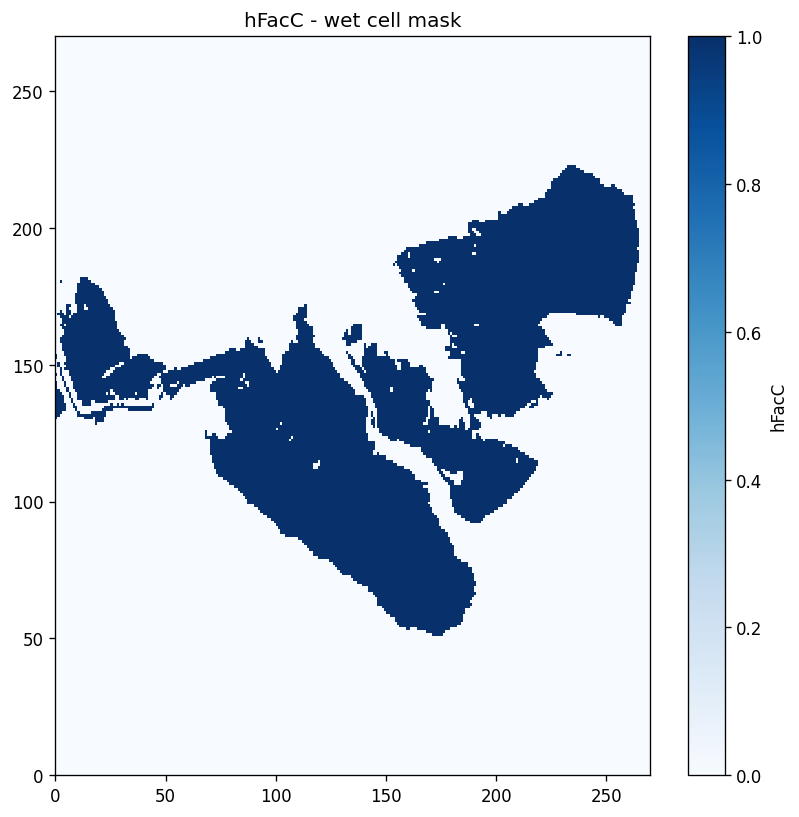
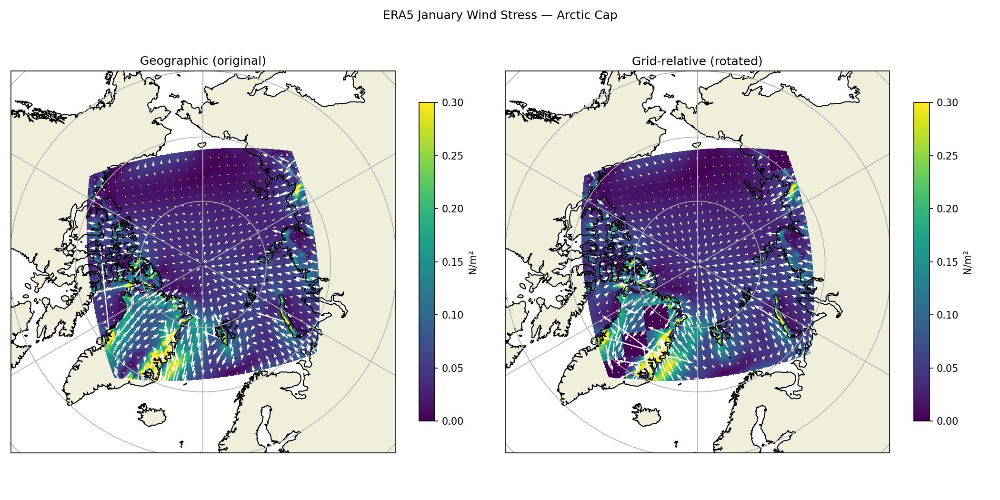
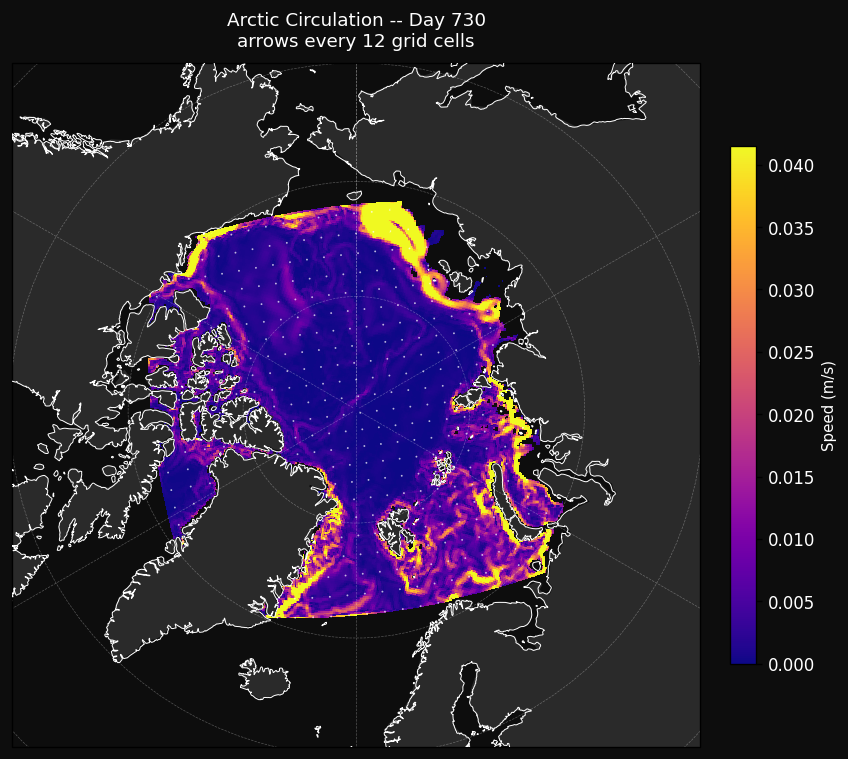
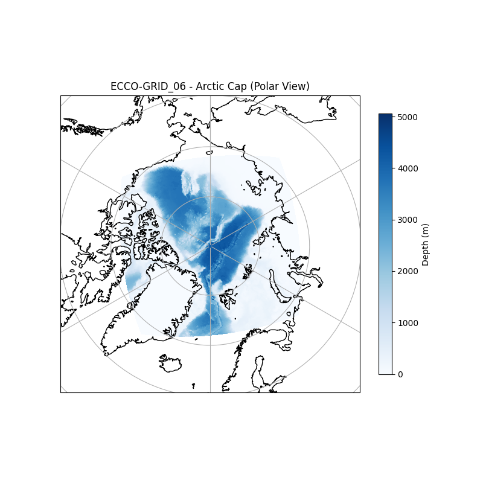

# Arctic Circulation - Experiment 1: Baseline Barotropic

Baseline Arctic Ocean simulation using MITgcm with wind-only forcing on the LLC270 lat-lon-cap grid.
Single-layer barotropic, closed basin.

## Experiment Summary

| Parameter | Value |
|-----------|-------|
| Grid | LLC270 Arctic cap tile (tile 6, 0-indexed) |
| Domain | 270 x 270 cells |
| Vertical layers | 1 (Nr=1, delR=5000m) |
| Wet cells | 52,533 |
| MPI decomposition | sNx=27, sNy=30, nPx=10, nPy=9 (90 ranks) |
| Time step | 1200 s |
| Run length | 2 years (nTimeSteps=52560) |
| Output frequency | 5-day snapshots (dumpFreq=432000) |
| Wind forcing | ERA5 1991-2020 monthly climatology, 12-month periodic |
| Max uvel | ~0.24 m/s |
| Max advcfl | ~0.033 |

## Physics

Wind-only forcing, barotropic, no tracers, no open boundaries.

## Directory Structure
```
baseline_exp_llc270/
|_ input_code/     -- preprocessing scripts (generate, rotate, wind stress)
|_ mitgcm_input/   -- generated binaries (.bin, .mitgrid)
|_ original_data/  -- raw source files (.nc, .tif, ECCO grid files)
|_ run/
|  |_ code/        -- SIZE.h and any CPP option files
|  |_ input/       -- namelists (data, data.pkg, eedata)
|_ analysis/
|  |_ scripts/     -- plotting and verification scripts
|  |_ figures/     -- all output figures and animations
|_ output/         -- HPC run outputs (gitignored)
```
## Key Bugs Resolved

**Binary precision mismatch** -- Bathymetry and wind stress written as float64 but
readBinaryPrec defaulted to 32, silently zeroing all hFacW values and producing zero
velocity fields. Fixed by setting readBinaryPrec=64 and writing all binaries as
big-endian float64.



**Wind stress coordinate rotation** -- ERA5 stress is in geographic east/north coordinates
but LLC270 Arctic cap grid axes are not geographically aligned. Fixed by rotating into
grid-relative coordinates using CS/SN from ECCO-GRID_06.nc.



## Results






## Conclusion

The simulation runs stably with plausible velocity magnitudes, confirming the grid,
bathymetry, and wind forcing pipeline are correctly configured. However, the Beaufort
Gyre and Transpolar Drift are essentially absent -- no coherent rotational structure
develops over the full 2-year run.

The primary suspect is the closed basin geometry. Without open boundaries at Bering,
Fram, and Davis Straits, the model cannot support the basin-scale sea surface height
gradients that organize Arctic circulation. This result directly motivates Experiment 3,
where opening the southern boundary is expected to be the minimum change needed to
recover these features.
