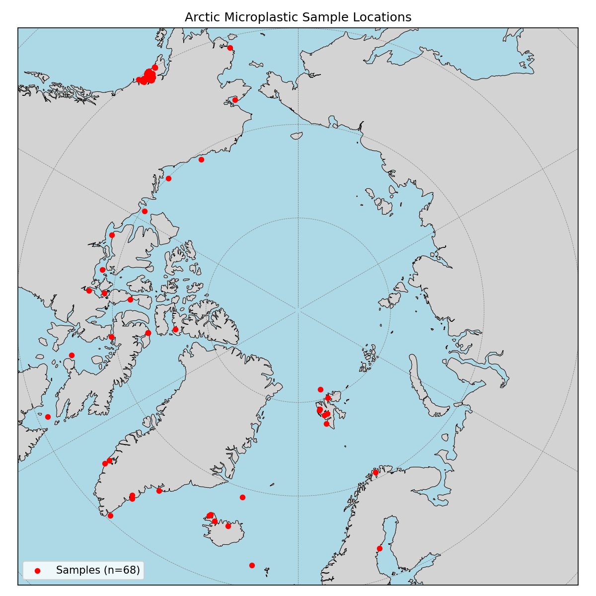
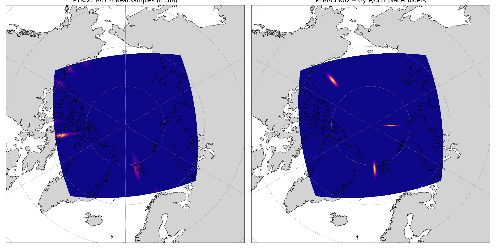
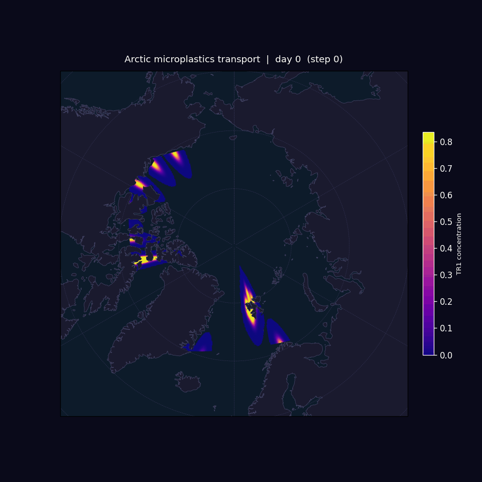

# EXP2: PTRACERS

**Status:** Complete  
**Run:** 2 years, 720 timestep verification + full 52560 timestep run  
**Grid:** LLC270 Arctic cap, 270x270, Nr=1 barotropic, 90 MPI ranks

---

## Setup

Identical to EXP1 (baseline_exp_llc270) with PTRACERS added.

- **PTRACER01**: 68 real Arctic microplastic sample locations, Gaussian spread (1.0 deg)
- **PTRACER02**: 3 circulation verification points (Beaufort Gyre, Transpolar Drift, Fram Strait)
- `advScheme=77` (flux-limited, monotone, positive-definite)
- `diffKh=0`, `diffKr=0`
- 5-day output dumps, 147 snapshots total

---

## IC Placement

---

## Results

Tracer advects stably with zero negatives throughout the run. Concentration hugs the coastline and never reaches the basin interior. No Beaufort Gyre or Transpolar Drift signature visible.

**advScheme=2 was tried first and failed** -- negatives grew to -17 by day 200, spreading to 5500+ spurious cells. The phantom circulation visible in that run was numerical noise, not physics.

---

## Conclusions

The closed basin geometry is the likely cause of absent interior circulation. Without open boundaries, there is no mechanism to drive the Beaufort Gyre or Transpolar Drift. Tracers behave correctly given the flow field -- the flow field itself is the problem.

**EXP3 goal:** open boundaries (OBCS) to drive realistic interior circulation.