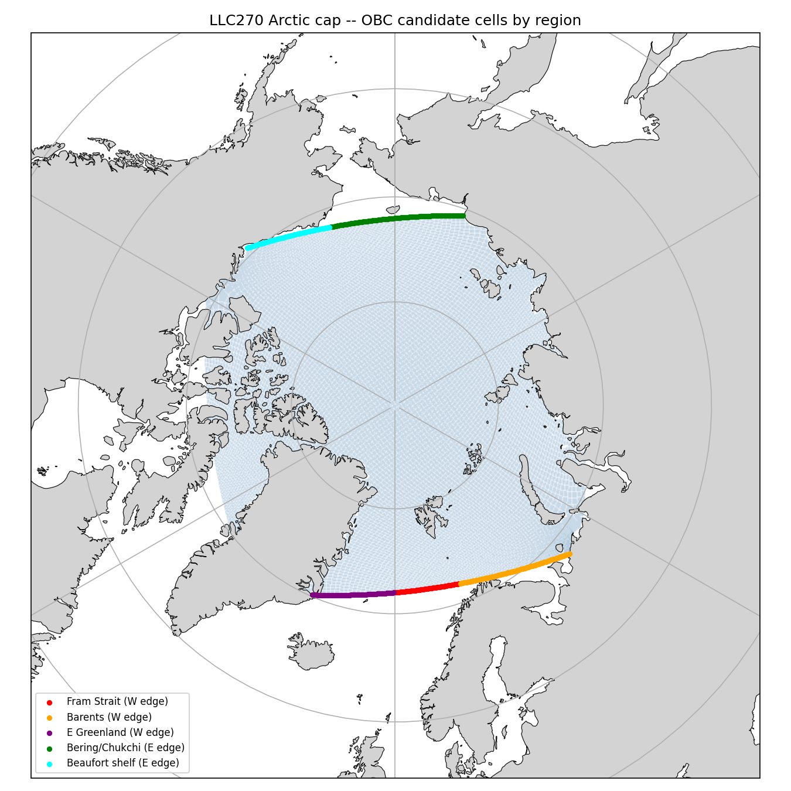
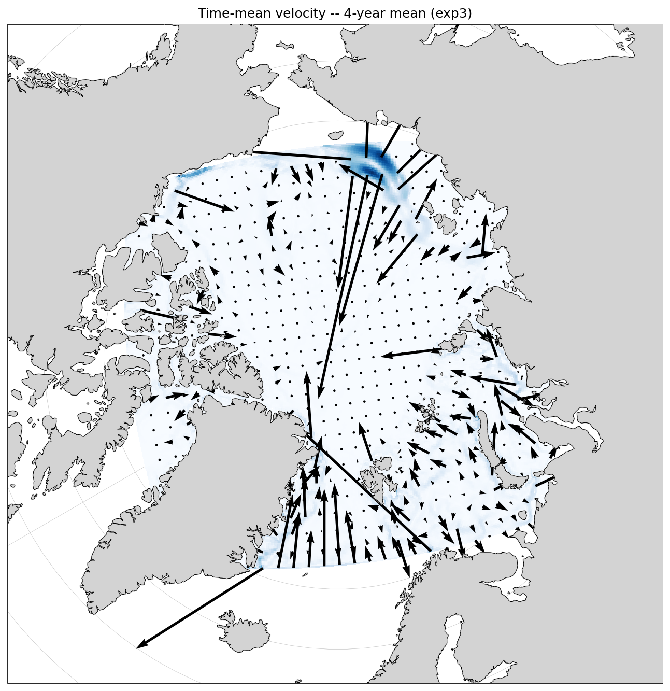
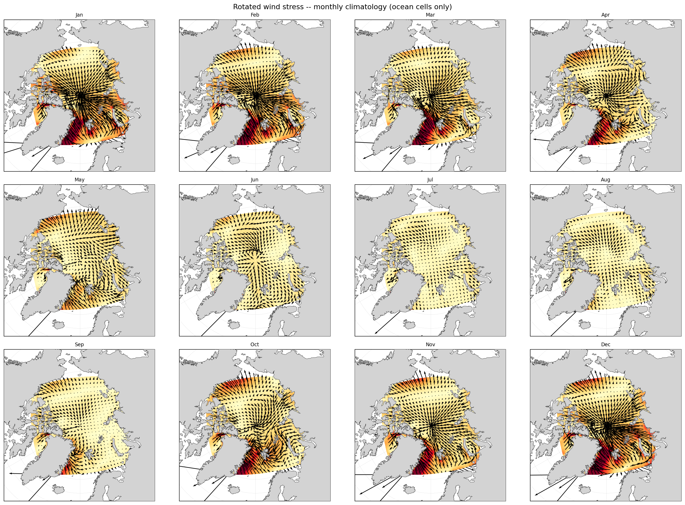

# exp3_openbounds

Extension of exp2_ptracers with open boundary conditions (OBCS) at the
western (Fram Strait / Barents) and eastern (Bering / Beaufort) domain edges
using Orlanski radiation. Bathymetry regenerated without closed-basin masking
to ensure edge cells are wet.

## Configuration

- Base: identical to exp2_ptracers
- OBCS: OB_Iwest j=16-213, OB_Ieast j=69-230, Orlanski radiation (default)
- Bathy: IBCAO v5 on LLC270 grid, no Bering closure, no region filtering
- Run length: 4 years, deltaT=1200, dumpFreq=432000 (294 snapshots)

## Open Boundary Setup

OBC candidate cells identified empirically from bathymetry edge columns:

## Results

Opening the boundaries produced no meaningful change in interior circulation.
The Beaufort Gyre and Transpolar Drift remain absent. Time-mean velocity
shows weak southward flow throughout the interior with a high-velocity
artifact at the Fram Strait boundary cells.

Wind stress diagnostics show radially outward vectors from the pole in all
12 months -- inconsistent with the known seasonal Beaufort High anticyclone
over the Canada Basin. The ERA5 wind stress rotation (geographic to
grid-relative via CS/SN) is likely incorrect, producing wrong curl sign or
magnitude over the interior basin. This would suppress the Beaufort Gyre
regardless of boundary conditions.

## Conclusion

The absence of interior circulation in exp1-exp3 is likely attributable to
an error in the ERA5 wind stress rotation rather than closed-basin geometry.
The rotation should be verified and corrected before further boundary
condition experiments are meaningful.